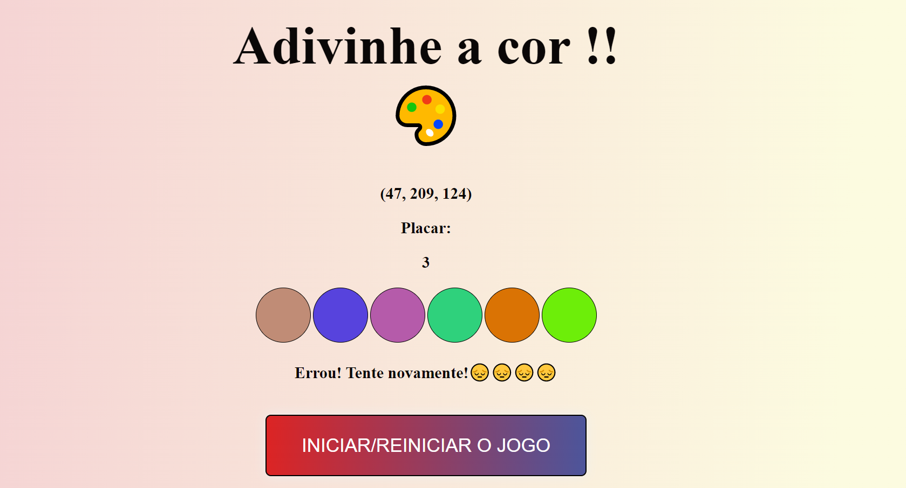

# Boas vindas ao repositório do projeto de adivinhação de Cor!

# Sobre o projeto:

É um projeto para praticar e testar habildiades de:
- Manipular o DOM.

- Manipular o Javascript.

- Manipular o CSS.

## O que foi desenvolvido:

- Foi desenvolvido uma aplicação utilizando JavaScript, HTML5 e CSS3.

- Nesta aplicação é possível jogar um jogo de adivinhação de cores e sua pontuação atualiza de acordo com os acertos.

---
Vizualização do projeto 
